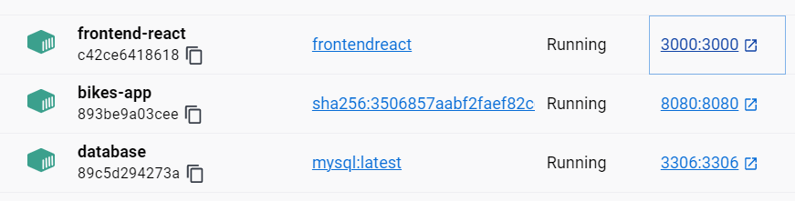
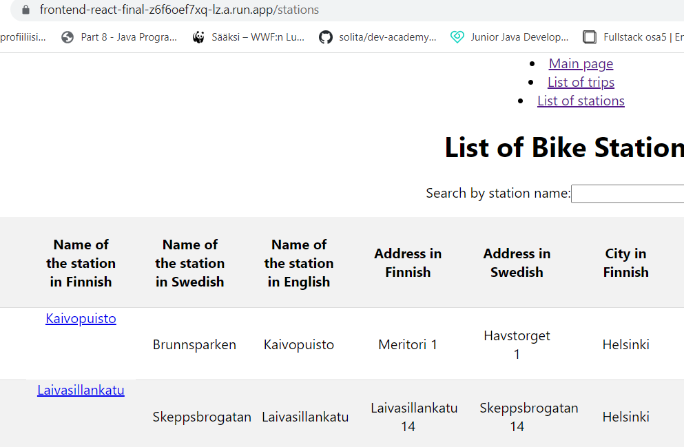

# Helsinki City Bike Application

.jpg)

Photo by Eric Fischer, CC BY 2.0 <https://creativecommons.org/licenses/by/2.0>, via Wikimedia Commons

## Table of Contents
***
1. [What does this application do?](#what-does-this-application-do)
2. [Technologies](#technologies)
3. [Installation and running the application](#installation-and-running-the-application)
4. [Database](#database)
5. [Features](#features)
6. [Running the whole application in Docker](#running-the-whole-application-in-docker)
7. [Running the whole application in GCP](#running-the-whole-application-in-gcp)
8. [Reflections and what next?](#reflections-and-what-next)

### What does this application do?
***
This Helsinki City Bike application is based on the data of the Helsinki City Bike trips and stations on summer 2021. Users and list, sort and search for the trips and stations as well as find detailed information about the stations. For example it's possible to find out, which was the longest trip made or the most popular station in the summer 2021 :) This is Solita's pre-assignment exercise 2023.

### Technologies
***
A list of technologies used within the project:

* [JDK](https://openjdk.org/): Version 17
* [Spring Boot](https://spring.io/): Version 3.0.6
* [MySQL](https://mysql.com): Version 8.0.32
* [React](https://react.dev/): Version 18.0.2
* [React Router](https://reactrouter.com/): Version 6.11.1
* [Node.js](https://nodejs.org/): Version 18.14.1
* [TablePlus](https://tableplus.com/): For importing big csv.files and mapping them correctly
* [Insomnia](https://insomnia.rest/): For testing and interacting with backend endpoints and validating API functionality.
* [Docker](https://docker.com): For packaging and running the application in containers.
* [GCP](https://console.cloud.google.com/): For building and deploying the application on the cloud.

This application was made on Windows 11.
The backend of the application is built using Spring Boot, a Java-based framework, with JDK 17. It utilizes MySQL as the database for data storage.
The frontend of the application is built using React and utilizes React Router for routing functionality. Node.js is required as a prerequisite for development and building the React application.

### Installation and running the application
***
1. Clone the repository to your local machine.
2. Navigate to the project directory.
3. Install the necessary dependencies for the backend using the package manager of your choice (for example Maven).
4. Configure the database connection in the application properties file located in the backend directory.
5. Run the project using the provided build command.
6. Install the necessary dependencies for the frontend using the package manager of your choice (for example NPM).
7. Run the frontend development server.
8. The application will run in your web browser at http://localhost:3000.

### Database
***
1. First I created the database "bikes" and added 2 tables on it:

  
  

2. After creating the tables, I imported the datasets about journeys (in my database journeys are called trips) and stations from these files into the database using TablePlus. I changed the names of some of the csv-files columns to match them with my database tables. I also omitted "FID" (autogenerated id) from the stations file and used a separate id field "ID" instead.
* https://dev.hsl.fi/citybikes/od-trips-2021/2021-05.csv
* https://dev.hsl.fi/citybikes/od-trips-2021/2021-06.csv
* https://dev.hsl.fi/citybikes/od-trips-2021/2021-07.csv
* https://opendata.arcgis.com/datasets/726277c507ef4914b0aec3cbcfcbfafc_0.csv

3. I did cleaning and updating of the data in MySQL client by running these queries: 

* DELETE FROM trips WHERE distance_m is < 10;
* DELETE FROM trips WHERE duration_s is < 10;
* DELETE FROM from trips WHERE id IN (SELECT id FROM trips GROUP BY departure, `return`, departure_station_id, departure_station_name, return_station_id, return_station_name, distance_m, duration_s HAVING COUNT(*) > 1);
* UPDATE stations SET city_fin = "Helsinki" WHERE city_fin is null;
* UPDATE stations SET city_swe = "Helsingfors" WHERE city_swe is null;

### Features
***
these features can be found from my application:
1. Journey list view
* Lists journeys, shows departure and return stations, covered distance in kilometers and duration in minutes
* Pagination, ordering per column
2. Station list
* Lists all the stations
* Pagination, searching, links to the single station view
3. Single station view
* shows station name, station address, total number of journeys starting from the station, total number of journeys ending at the station, the average distance of a journey starting from the station, the average distance of a journey ending at the station, top 5 most popular return stations for journeys starting from the station and top 5 most popular departure stations for journeys ending at the station
4. Endpoints to store new journeys data or new bicycle stations
* possible to create, update and remove journeys and stations
5. [Running the whole application in Docker](#running-the-whole-application-in-docker)
6. [Running the whole application in GCP](#running-the-whole-application-in-gcp)

### Running the whole application in Docker
***

This is how I did it:
1. I got Docker  (https://www.docker.com/products/docker) and installed it.
2. I started Docker Service (I used Docker Desktop and it needs to be running when building and running containers).
3. For the database, I created MySQL Docker Container by pulling the latest MySQL Docker image and running it ("docker pull mysql:latest" and "docker run (write here your own configurations about the name of the container, port it's using, networks, tags etc)" !Remember! The MySQL container needs to be located in the same network as the Spring Boot container, so create network (docker network create "nameofthenetwork) and use --network="nameofthenetwork" as a configuration on both of them.
4. I exported the database as a SQL dump using MySQL Workbench and then copied it into the MySQL Container. Depending on your application, you might not need to do this.
5. I packaged my backend Spring Boot application. If using Maven write "mvn clean package" in the backend folder, but before that change the application properties so that the application connects to the MySQL Container instead of localhost. Url should be something like this: jdbc:mysql://"nameofthemysqlcontainer":"port"/"nameofthedatabase". 
6. I created a Dockerfile in the backend folder. You can see my really simple Dockerfile in the repository :) What it does? It pulls a JDK-image (there are plenty to choose from), then copies my application there, exposes the application in port 8080 and the entrypoint shows that the default command to run when the container starts is to execute a Java JAR file.
7. I created a Dockerfile in the frontend folder the same way I did with the backend Dockerfile, only using different image, application port and entrypoint.
8. I built and ran the Spring Boot Container. In your backend folder (where the Dockerfile is also located), write "docker build -t "nameoftheimage" ."" Remember the dot in the end. After building, you can run the container the same way you did the MySQL Container: "docker run (write here your own configurations about the name of the container, port it's using, networks etc).
9. I built and ran the frontend React Container. Follow the previous advise but do everything in your frontend folder.
10. That's it! You should now have three running containers and you should be able to see your whole application and use it!
11. This is a very simplified guide and may contain mistakes as I'm still trying to learn the secrets of Docker. For more information and guidance, I recommend this page: https://docker-curriculum.com/ and be ready to google a lot!

### Running the whole application in GCP
***

This is how I did it:
1. You can get a free trial of Google Cloud Platform with your gmail-address. First set up a GCP account here: https://cloud.google.com/. It's also good idea to read about the basics of GCP for example in here: https://cloud.google.com/docs/overview
2. First I set up a Cloud SQL instance and imported my bike database there. I used the SQL dump I exported from MySQL Workbench while making Docker database. I also set a new user and password for the instance.
3. Then I changed the backend's application properties to include the cloud-sql-database instance connection name and database name as well as username and password. In my pom.xml I added these dependencies: spring-cloud-gcp-dependencies & spring-cloud-gcp-starter-sql-mysql. If you have @crossorigins set up on some spesific address (I had localhost:3000), you have to change it after you know the url of your frontend service.
4. Then I made a new Java JAR, built a new backend image and tagged and pushed it into GCP Artifact Registry. I followed these instructions: https://cloud.google.com/artifact-registry/docs/docker/pushing-and-pulling You need to install Google Cloud SDK to be able to push the image into Artifact Registry as you need to authenticate yourself.
5. After the backend image was in the Artifact Registry, I opened Cloud Run, created new service and used the image I just pushed to the registry. In addition to this, it's important to add the connection to the database - you can do it in the end of creating the service by choosing the database instance you just made in Cloud SQL. Then you deploy your service and after a while you can check the URL and try your endpoints! It's useful to check the logs of the service as well - I had problems with my database configuration, but after understanding what the problem is, it was easy to fix.
6. For my frontend I made changes to the url's I was using, so no more localhost:8080, but the url of the backend Cloud Run service. 
7. Then I built the frontend image and tagged and pushed also that one to the Artifact Registry and started a new Cloud Run service using that image. Then you should have 2 services running and also 2 new urls. Notice! If you have @crossorigins set up on some spesific address (I had localhost:3000) in your backend code, you have to change it after you know the url of your frontend service and build a new image, push it to the registry and edit your service.
8. That's it! Now I can see the application running in the frontend url and I have sent the address to everyone I know so they can see what I have done :)
9. This is a very simplified guide again and probably includes some mistakes. 

### Reflections and what next?
***
This was my first ever application made by myself and I'm proud of it! It took less than 3 weeks to complete and all the main functionalities work. I'm also happy that I was able to dockerize the whole application as well as deploy it on the cloud. Next time I'd spend more time thinking about the structure of the application and yes, using term "trip" instead of "journey" was a stupid mistake, which I noticed too late. It would also be interesting to use Java instead of MySQL Workbench to programmatically define the table structure and read the data files for the database. If I'd had more time, I'd added webpages for creating, updating and deleting the stations and journeys - the endpoints are ready :)

##### I'd still like to learn more about:
* Testing - now my tiny Mockito-tests are the just the most simple tests there are. I have plenty to learn on this field. 
* Frontend - this is my first time doing something with React and I can say I learned a lot about the structure and basic functions, but the webpage does not have all the functionality (and nice looks) that there should be.
* Databases - MySQL is the most familiar for me, but I'd like to try for example MongoDB in a similar exercise. I'd also like to learn more about planning and designing an excellent database. 
* Mobile version - I have no idea (yet), how to make this application work in mobile environment, but that's also something I'd like to learn.
